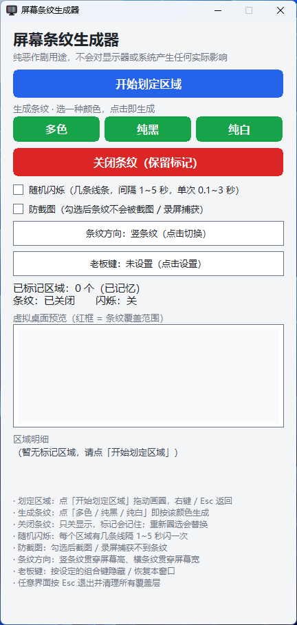

# 屏幕条纹生成器

在屏幕上伪造一块「屏幕损坏」的条纹区域 —— 仅供演示与娱乐。

[English](README.en.md) ｜ **简体中文**

---

## 这是什么

一个 Windows 小工具：你在屏幕上随手圈出一块范围，它就在那里铺满贯穿全屏的随机彩色细线，
看起来像液晶屏出现了断列、彩条、闪烁等故障。缝隙处是**真透明** —— 桌面照常可见、照常可点。

整个程序用 **Rust + Win32 手写实现，零第三方依赖**（连随机数都是自己写的），
编译出来是**一个约 350 KB 的单文件 exe，不需要任何运行库**。

<!-- 预览：图片放进 docs/ 后取消注释
| 主界面 | 竖向条纹 |
| --- | --- |
|  |  |
-->

## 下载

**[前往 Releases 下载最新版](https://github.com/oywq00008-cell/Screen-Stripe-Generator/releases/latest)**

单文件绿色版，**无需安装**，双击即用。当前版本 **v0.1**（353.5 KB，x64）。
每个 Release 都附有 exe 的 SHA256，下载后可自行校验完整性。
想自己编译的话见下方「从源码构建」。

## 功能

| 功能 | 说明 |
| --- | --- |
| **自由圈选** | 按住左键拖动画圈标记范围，可连续圈多个；右键 / 回车 / Esc 结束 |
| **两种方向** | 竖条纹取圈的左右范围、贯穿屏幕高度；横条纹取上下范围、贯穿屏幕宽度；切换即时重绘 |
| **三种颜色** | `多色`（红/绿/蓝/黑/白等概率）、`纯黑`、`纯白`，点哪个就是哪个 |
| **随机闪烁** | 勾选后每个区域内有几条线隔 1~5 秒闪一次（单次消失 0.1~3 秒），其余始终常亮；区域内永远不会变成全空 |
| **老板键** | 点一下设置组合键，按下即隐藏 / 恢复控制面板；**条纹不受影响**，继续显示 |
| **防截图** | 勾选后条纹不会被截图 / 录屏捕获（默认关闭，即可被捕获） |
| **鼠标穿透** | 整层对鼠标完全透明，桌面照常操作，不会被"损坏带"挡住 |
| **启动免责声明** | 启动必须明确同意才能进主界面，不同意立即退出，没有跳过开关 |

## 系统要求

- **Windows 10 / 11（x64）**，已在 Windows 11 实测
- 「防截图」需 **Windows 10 2004（build 19041）及以上**；更早系统会自动退化为在截图中显示成黑块
- 无需 .NET / VC++ 运行库，无需管理员权限

## 使用

1. 运行 `screen_stripe.exe`，阅读免责声明并点「同意并继续」
2. 点「开始划定区域」→ 屏幕变暗进入圈选模式 → 按住左键拖动画圈（可圈多个）→ 右键 / 回车 / Esc 返回
3. 点「多色 / 纯黑 / 纯白」任一个，即按该颜色生成条纹
4. 需要时切换「条纹方向」「随机闪烁」「防截图」；「关闭条纹」只关显示，**标记区域会记住**
5. 老板键：点「老板键」那一行 → 按下要绑定的组合键（需含 Ctrl / Alt / Shift / Win）→ 之后按它即可隐藏 / 恢复面板
6. 任意界面按 **Esc** 可安全退出并清理所有覆盖层

## 从源码构建

需要 Rust（`stable-x86_64-pc-windows-msvc`）以及 MSVC 工具链与 Windows SDK。

```bash
cd rust
cargo build --release --target x86_64-pc-windows-msvc
```

想要「零依赖单文件」（静态链接 CRT，任何 Windows 直接能跑）：

```bash
set RUSTFLAGS=-C target-feature=+crt-static
cargo build --release --target x86_64-pc-windows-msvc
```

或直接双击 `rust/build.bat` —— 它会用静态 CRT 构建，并把成品复制到 `rust/dist/`。

## 技术要点

- **零依赖**：不引入任何 crate，Win32 调用全部以手写 `extern "system"` 声明完成，构建无需联网
- **单文件**：静态链接 CRT，约 350 KB，无外部 DLL
- **覆盖层**：全屏无边框置顶窗口 + `LWA_COLORKEY` 色键透明做"视觉镂空"，再叠加
  `WS_EX_TRANSPARENT` 让整层对鼠标完全透明。注意**色键只管视觉、不管鼠标穿透**，
  这两件事必须分开做，否则全屏窗口会吞掉整个桌面的点击
- **防截图**：`SetWindowDisplayAffinity(WDA_EXCLUDEFROMCAPTURE)`
- **老板键**：`RegisterHotKey`，主消息循环直接接收 `WM_HOTKEY`
- **界面**：主窗口与弹窗都是整窗自绘（GDI + 双缓冲 + 矩形命中测试），不依赖任何控件库

## 已知限制

- **盖不住开始菜单**：开始菜单、搜索面板、任务视图、Alt+Tab、通知中心等由 Windows 系统
  合成器直接绘制，普通程序的窗口无法置于其之上（这是系统设计，非本程序缺陷）。
  覆盖层能压过桌面、所有普通窗口、其它置顶程序以及任务栏。
- **防截图只能防软件捕获**：手机拍屏、HDMI 采集卡、虚拟机宿主层抓取均无法防止。
- **目前仅支持 Windows**（x64）：透明层依赖 Windows 的色键与显示亲和性 API。
  **后续可能会移植到 macOS 与 Linux** —— 两者的窗口透明实现在系统层面完全不同
  （macOS 走窗口透明属性，Linux 走 X11 SHAPE 扩展），需要分别实现。

## 免责声明

- 本软件是**免费开源软件，遵循 MIT 协议**，不包含也不提供任何收费内容或付费功能。
- 本软件**仅用于屏幕显示效果的演示与娱乐用途**。请勿用于任何违法或不当用途，包括但不限于：
  伪造设备故障以骗取维修、保修或保险赔付；干扰他人正常工作、学习或造成他人损失；
  用于任何需要真实性的场合（如报修、举证、鉴定）。
- 依据 MIT 协议，本软件按「原样」提供，不附带任何明示或默示的担保。
  **如将本软件用于非法或不当用途，由此产生的一切法律责任与后果均由使用者自行承担，
  作者与贡献者不承担任何责任。**

## 许可

本项目采用 **MIT License**。
